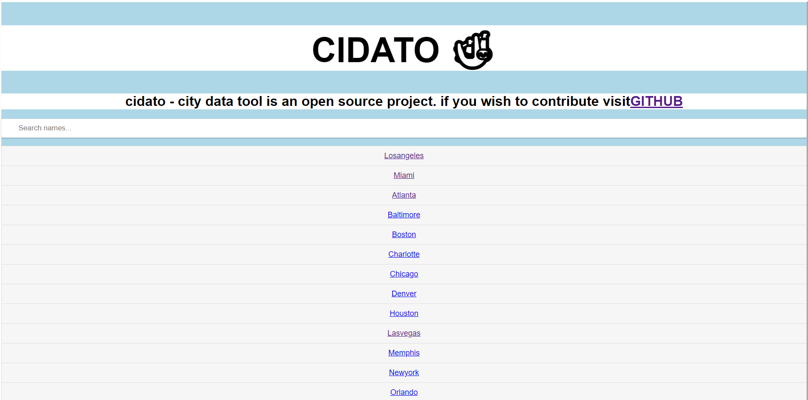
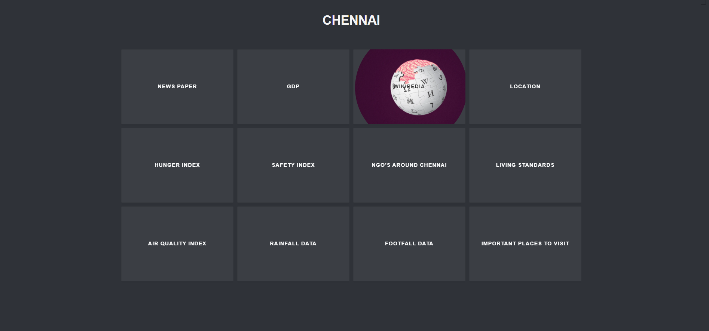

# CIDATO - CITY DATA TOOL 
  *  CIty DAta TOol is a open source project, that has data's of most city's in the world.

# Future for CIDATO 
  * This projects is a simple Web 1.0 app that used {a} tag to provide data.
  * In future, UI/UX will be improved, Api calls will be integrated for vast variety amount of data, User Registration and sign in will be created, and contribution tab will be implemented for more precise data.

# Stack Used :
  * Html
  * Css
  * Javascript

# Screenshots of the project ⬇️

# Live demo :
  * link - https://heuristic-payne-eb4a91.netlify.app/
